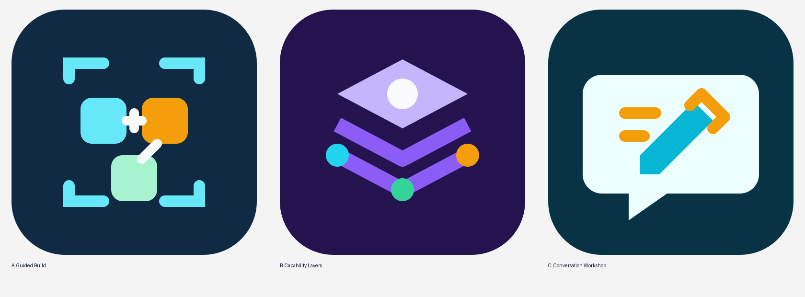

# Skills-First Plugin Builder

A conversational, skills-only project that guides people through creating or improving a selected ChatGPT plugin.

The Builder begins with the plugin's audience and outcome, proposes the smallest useful skill design, and then evaluates MCP, OAuth, and custom UI separately. Each capability is recommended only when the selected plugin has evidence-backed requirements for it. Benchmarking, audit, and reviewable repair support remain secondary to guided creation.

> This is an independent community project and is not affiliated with or endorsed by OpenAI. ChatGPT, Codex, and OpenAI are trademarks of OpenAI, L.L.C.

## What it does

- Guides creation one focused question at a time.
- Preserves confirmed requirements and labels unknowns `Unresolved`.
- Suggests realistic MCP, OAuth, and custom UI improvements with benefits, risks, and visual comparisons.
- Builds selected-plugin quality, reliability, stress-tolerance, and performance checks.
- Proposes bounded bug patches for review before applying them.
- Prevents benchmark infrastructure or unrelated tooling from replacing the selected plugin.

## Current architecture

This release is intentionally **skills-only**. It does not ship an MCP server, OAuth flow, or custom UI. Those capabilities belong to a user-selected plugin only when its requirements justify them.

## Repository layout

```text
skills/building-chatgpt-plugins/
├── SKILL.md
├── agents/openai.yaml
├── assets/icon.svg
└── references/plugin-workflow-checklist.md

icon-options/              Original candidate icons for owner selection
tests/                     Publication and scope-regression checks
```

## Install for local development

Copy `skills/building-chatgpt-plugins` into the skills directory supported by your ChatGPT or Codex development environment. Installation details can vary by product surface, so verify the current official OpenAI plugin and skills documentation before distribution.

## Example prompts

- “Guide me through creating a ChatGPT plugin one focused question at a time.”
- “Show how MCP, OAuth, or a custom UI could improve this selected plugin.”
- “Benchmark this plugin’s quality and reliability without building a separate benchmark product.”
- “Reproduce this plugin bug and propose a minimal patch for my review.”

## Test

```bash
python -m unittest discover -s tests -v
```

## Icon selection

Guided Build is the selected official icon. Three original designs remain in `icon-options/` for project history, and `icon-options/icon-a-guided-build.svg` is mirrored at `skills/building-chatgpt-plugins/assets/icon.svg`.



## Release status

`v0.1.0` is the first public release. The final branding, secrets, attribution, repository review, focused regression suite, and GitHub Actions validation are complete.

## License

Released under the MIT License. See `LICENSE` and `NOTICE.md`.
